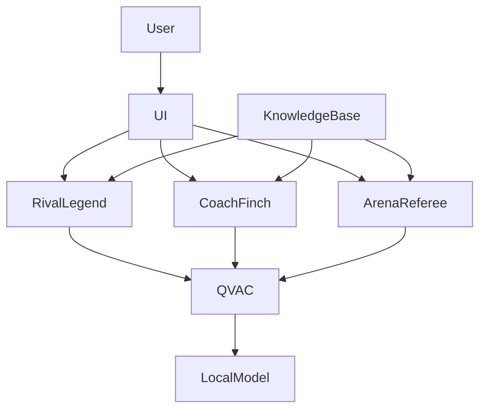

<div align="center">


# ⚽ GOAT Arena

### Defend Your Legend. Challenge the Rival. Conquer the Arena.

*A Local-First Multi-Agent Football Fan Battlefield Powered Entirely by QVAC*

<br>

<a href="https://github.com/tetherto/qvac">
  
</a>


</div>

---

<p align="center">

*"Every football fan thinks they can win the argument.*

*GOAT Arena finally gives them an opponent that fights back."*

</p>

---

## 🎥 Demo Video

<p align="center">
  <a href="https://youtu.be/u84R9EKBsTc">
    
  </a>
</p>

<p align="center">
  <b>Click the image above to watch the full demo</b>
</p>

# 📖 Table of Contents

- [🚀 Executive Summary](#-executive-summary)
- [⚽ Why GOAT Arena Exists](#-why-goat-arena-exists)
- [🧠 Why QVAC?](#-why-qvac)
- [🤖 Agent Design](#-agent-design)
- [🎮 Game Flow & Rounds](#-game-flow--rounds)
- [🏆 Scoring System](#-scoring-system)
- [🚀 Setup Instructions](#-setup-instructions)
- [🏗️ System Architecture](#️-system-architecture)
- [🗺️ Future Roadmap](#️-future-roadmap)
- [📄 License](#-license)

---

# 🚀 Executive Summary

GOAT Arena is a local-first AI football fan battlefield built for the QVAC × Tether Hackathon.

Instead of arguing endlessly on social media, users enter a competitive arena where they must defend their football legends and national teams against intelligent AI rivals running entirely on-device.

Users can enter iconic rivalries such as:

- Messi vs Ronaldo
- Mbappé vs Haaland
- Argentina vs Brazil

The platform uses a multi-agent architecture powered by QVAC:

- ⚔️ Rival Legend (Opponent Agent)
- 🦉 Coach Finch (Strategic Assistant)
- 🏛️ Arena Referee (Judge Agent)

Every rebuttal, coaching suggestion, and referee verdict is generated locally through QVAC.

No cloud APIs.

No subscriptions.

No external inference.

Just local intelligence.

---

# ⚽ Why GOAT Arena Exists

Football fans argue everywhere.

Twitter.

Reddit.

WhatsApp.

Discord.

Watch parties.

Stadiums.

The debates never end.

Who is the GOAT?

Which country has the better legacy?

Which player deserves the spotlight?

Most discussions end with opinions, noise, and repetition.

GOAT Arena transforms these conversations into an interactive AI-powered fan battle experience.

Instead of arguing with strangers online, fans battle a relentless AI opponent that never backs down.

The result is a more engaging, competitive, and intelligent football discussion experience.

---

# 🧠 Why QVAC?

This project was intentionally designed around QVAC.

Most AI applications depend on:

| Traditional AI |
|---------------|
| Cloud APIs |
| Internet Access |
| Monthly Costs |
| External Infrastructure |
| User Data Leaving Device |

GOAT Arena takes the opposite approach.

Everything runs locally.

## Why Local AI Matters

### 🔒 Privacy First

Arguments remain on the user's machine.

No conversations are sent to external servers.

### 📴 Offline Gameplay

The arena continues to function even without internet access.

### ⚡ Low Latency

No network round trips.

No API queues.

Responses are generated directly on-device.

### 💰 Zero Usage Cost

Users own the experience.

No subscription required.

### 🛠️ Developer Ownership

The intelligence stack is completely local and customizable.

---
# 🤖 Agent Design

GOAT Arena is powered by three specialized agents that intentionally have different personalities, capabilities, and responsibilities.

Rather than relying on a single general-purpose AI, each agent is optimized for a specific role inside the arena.

This creates a more balanced, competitive, and engaging debate experience.

---

## ⚔️ Rival Legend

### Role

Primary opponent.

The Rival Legend exists to challenge the player and create a competitive football debate environment.

### Design Philosophy

Most AI assistants are designed to be helpful, agreeable, and cooperative.

That approach creates boring debates.

The Rival Legend was intentionally designed to be:

- Competitive

- Aggressive

- Sarcastic

- Entertaining

- Confident

- Relentless

The agent aggressively defends its assigned football side and constantly attacks weaknesses in the player's arguments.

### Responsibilities

- Defend assigned football legend or team

- Rebut player arguments

- Challenge weak reasoning

- Introduce supporting evidence

- Maintain pressure throughout the debate

### Goal

Create the feeling of debating a passionate football fan who never backs down.

---

## 🦉 Coach Finch

### Role

Strategic assistant.

### Design Philosophy

Coach Finch was intentionally designed to be less capable than the Rival Legend.

This decision was made to preserve game balance.

If Coach Finch generated perfect responses for every situation, the player would never need to think and the challenge would disappear.

Instead, Coach Finch acts like an assistant coach rather than a debate autopilot.

### Responsibilities

- Provide supporting facts

- Suggest counterarguments

- Offer historical context

- Highlight weaknesses in opponent claims

### Restrictions

Coach Finch:

- Does not directly debate

- Does not generate complete winning responses

- Does not replace player decision making

- Only answers specific strategic questions

### Goal

Help players improve their arguments while keeping the game challenging and rewarding.

---

## 🏛️ Arena Referee

### Role

Independent judge.

### Design Philosophy

The Arena Referee never participates in the debate.

Its responsibility is to evaluate every round objectively and determine the winner based on argument quality.

### Responsibilities

- Evaluate both participants

- Score each round

- Generate explanations

- Produce the final verdict

### Goal

Create fair, transparent, and explainable debate outcomes.

---

# 🎮 Game Flow & Rounds

Every debate follows a structured multi-round format.

| Stage | Description |

|---------|-------------|

| Rivalry Selection | User chooses the football rivalry |

| Side Selection | User selects a legend or national team |

| Round 1 | Opening arguments |

| Round 2 | Rebuttal phase |

| Round 3 | Advanced counterarguments |

| Strategic Timeout | Coach Finch becomes available |

| Final Round | Closing statements |

| Verdict | Arena Referee evaluates results |

The structure transforms a normal chat interaction into a competitive football debate experience.

---

## 🎯 Playability Design

GOAT Arena was designed as a game rather than a chatbot.

Key gameplay principles include:

| Feature | Purpose |

|----------|----------|

| Competitive Rival Agent | Creates challenge and replayability |

| Strategic Timeout | Allows coaching without making the game trivial |

| Multi-Round Format | Encourages argument development |

| Structured Scoring | Creates clear win/loss conditions |

| Football Knowledge Base | Grounds arguments in real football information |

| Local AI Inference | Provides fast responses and privacy |

---

# 🏆 Scoring System

The Arena Referee evaluates both participants independently during every round.

Each round is scored across four categories.

| Criteria | Description |

|-----------|-------------|

| Evidence | Use of facts, statistics, achievements, and historical examples |

| Logic | Strength and consistency of reasoning |

| Relevance | How well the response addresses the current debate topic |

| Persuasion | Ability to convince and challenge the opponent |

---

## Round Scoring

Each category receives a score from:

```text

0 - 10

```

Maximum score per round:

```text

Evidence (10)

+ Logic (10)

+ Relevance (10)

+ Persuasion (10)

= 40 Points

```

### Example

| Criteria | Score |

|-----------|--------|

| Evidence | 8 |

| Logic | 7 |

| Relevance | 9 |

| Persuasion | 8 |

| Total | 32 / 40 |

---

## Match Scoring

Scores accumulate throughout the debate.

```text

Final Score

=

Round 1

+

Round 2

+

Round 3

+

Final Round

```

The participant with the highest total score wins the arena.

---

## Why This Architecture Works

The three-agent architecture creates a balanced experience:

| Agent | Purpose |

|---------|---------|

| ⚔️ Rival Legend | Creates challenge |

| 🦉 Coach Finch | Provides assistance |

| 🏛️ Arena Referee | Ensures fairness |

Together these agents transform football debates from simple chat interactions into a structured competitive game powered entirely by local-first AI.

# 🚀 Setup Instructions

## Prerequisites

- Node.js 22.x
- npm 10.x

---

## 1. Install QVAC CLI

Install the QVAC CLI:

```bash
npm install -g @qvac/cli
```

Verify installation:

```bash
qvac --version
```

Validate your environment:

```bash
qvac doctor
```

You should see:

```text
✅ All required checks passed.
```

---

## 2. Clone the Repository

```bash
git clone <repository-url>
cd goat-arena
```

---

## 3. Install Project Dependencies

```bash
npm install
```

---

## 4. Start the Application

```bash
npm run dev
```

Open:

```text
http://localhost:3000
```

---

## Tested Environment

- Node.js 22.17.0
- npm 10.x
- QVAC CLI 0.8.0
- QVAC SDK 0.14.1
- macOS Sequoia

---

# 🏗️ System Architecture



## Knowledge Layer

```text
knowledge/
├── messi.md
├── ronaldo.md
├── mbappe.md
├── haaland.md
├── argentina.md
└── brazil.md
```

Section-based retrieval keeps prompts small and efficient for local inference.

---

## Notes

- GOAT Arena runs entirely on-device using QVAC.
- No external AI APIs are required.
- No manual model download or `qvac models pull` step is required.

---

## Verification

After startup:

✅ Model loads successfully  
✅ Rival Legend generates responses  
✅ Coach Finch provides coaching  
✅ Arena Referee produces scoring and verdicts
---

# 🗺️ Future Roadmap

Current version represents the MVP.

Future improvements include:

- Football-specific model fine-tuning
- Voice debates
- Multiplayer fan battles
- Tournament Mode
- Live crowd reactions
- Additional rivalries
- Larger local models
- Enhanced retrieval pipeline

---

# 📄 License

Apache License 2.0

Created for the QVAC × Tether Hackathon 2026.
