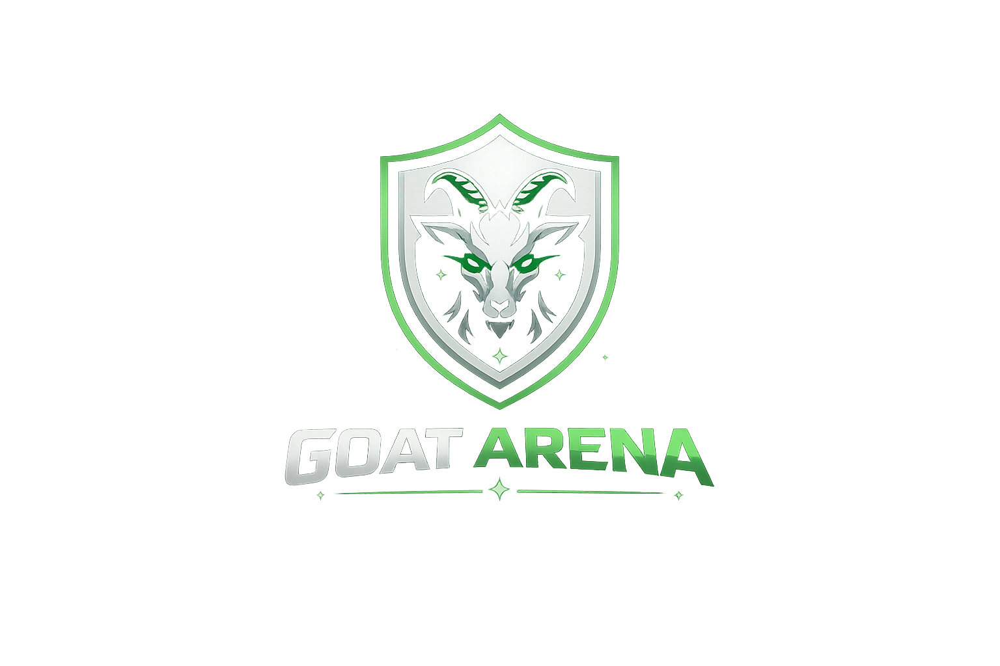
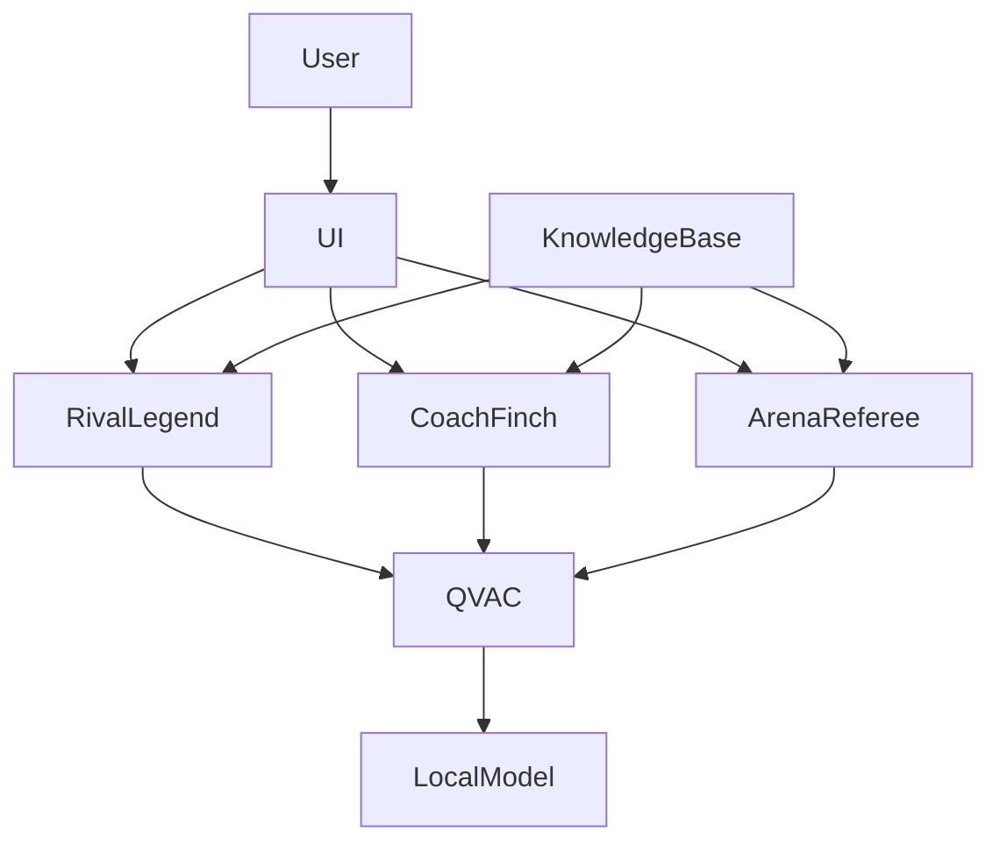

<p align="center">
  
</p>

<h1 align="center">⚽ GOAT Arena</h1>

<h3 align="center">
Defend Your Legend. Challenge the Rival. Conquer the Arena.
</h3>

<p align="center">
A Local-First Multi-Agent Football Fan Battlefield Powered Entirely by QVAC
</p>

<p align="center">


</p>

---

<p align="center">

*"Every football fan thinks they can win the argument.*

*GOAT Arena finally gives them an opponent that fights back."*

</p>

---

# 📖 Table of Contents

- Executive Summary
- Why GOAT Arena?
- Why QVAC?
- What We Built
- Meet The Agents
- Arena Modes
- System Architecture
- Screenshots
- Demo Video
- Local Setup
- Technical Stack
- Future Roadmap
- License

---

# 🚀 Executive Summary

GOAT Arena is a local-first AI football fan battlefield built for the QVAC × Tether Hackathon.

Instead of arguing endlessly on social media, users enter a competitive arena where they must defend their football legends and national teams against intelligent AI rivals running entirely on-device.

Users can enter iconic rivalries such as:

- Messi vs Ronaldo
- Mbappé vs Haaland
- Argentina vs Brazil

The platform uses a multi-agent architecture powered by QVAC:

- ⚔️ Rival Legend (Opponent Agent)
- 🦉 Coach Finch (Strategic Assistant)
- 🏛️ Arena Referee (Judge Agent)

Every rebuttal, coaching suggestion, and referee verdict is generated locally through QVAC.

No cloud APIs.

No subscriptions.

No external inference.

Just local intelligence.

---

# ⚽ Why GOAT Arena Exists

Football fans argue everywhere.

Twitter.

Reddit.

WhatsApp.

Discord.

Watch parties.

Stadiums.

The debates never end.

Who is the GOAT?

Which country has the better legacy?

Which player deserves the spotlight?

Most discussions end with opinions, noise, and repetition.

GOAT Arena transforms these conversations into an interactive AI-powered fan battle experience.

Instead of arguing with strangers online, fans battle a relentless AI opponent that never backs down.

The result is a more engaging, competitive, and intelligent football discussion experience.

---

# 🧠 Why QVAC?

This project was intentionally designed around QVAC.

Most AI applications depend on:

| Traditional AI |
|---------------|
| Cloud APIs |
| Internet Access |
| Monthly Costs |
| External Infrastructure |
| User Data Leaving Device |

GOAT Arena takes the opposite approach.

Everything runs locally.

## Why Local AI Matters

### 🔒 Privacy First

Arguments remain on the user's machine.

No conversations are sent to external servers.

### 📴 Offline Gameplay

The arena continues to function even without internet access.

### ⚡ Low Latency

No network round trips.

No API queues.

Responses are generated directly on-device.

### 💰 Zero Usage Cost

Users own the experience.

No subscription required.

### 🛠️ Developer Ownership

The intelligence stack is completely local and customizable.

---

# 🏆 What We Built During The Hackathon

## Arena Experience

- Rivalry Selection System
- Arsenal Preparation Phase
- Live Fan Battle Arena
- Strategic Timeout System
- Post-Match Verdict Screen

## Multi-Agent System

### Rival Legend

Defends the opposing side.

Challenges every argument.

Never intentionally concedes.

---

### Coach Finch

Private tactical assistant.

Available during strategic timeouts.

Provides:

- Facts
- Historical context
- Supporting points
- Counter arguments

---

### Arena Referee

Neutral judge.

Evaluates:

- Evidence
- Logic
- Persuasion
- Relevance

Generates structured match verdicts.

---

# 🤖 Meet The Agents

[Add screenshots of each agent panel here]

...

# 🏟️ Arena Modes

## Messi vs Ronaldo

...

## Mbappé vs Haaland

...

## Argentina vs Brazil

...

# 🏗️ System Architecture



## Knowledge Layer

```text
knowledge/
├── messi.md
├── ronaldo.md
├── mbappe.md
├── haaland.md
├── argentina.md
└── brazil.md
```

Section-based retrieval keeps prompts small and efficient for local inference.

---

# 📸 Screenshots

## Arena Selection

[IMAGE]

## Live Battle

[IMAGE]

## Strategic Timeout

[IMAGE]

## Final Verdict

[IMAGE]

---

# 🎥 Demo Video

YouTube Demo:

[INSERT YOUTUBE LINK]

---

# 🚀 Setup Instructions

## Prerequisites

- Node.js 22.x
- npm 10.x

---

## 1. Install QVAC

Install the QVAC CLI:

```bash
npm install -g @qvac/cli
```

Verify installation:

```bash
qvac --version
```

---

## 2. Download the Required Model

```bash
qvac models pull llama-3.2-1b-instruct
```

Verify the model is available:

```bash
qvac models list
```

You should see the downloaded model in the output.

---

## 3. Clone the Repository

```bash
git clone <repository-url>
cd Goat-Arena
```

---

## 4. Install Project Dependencies

```bash
npm install
```

---

## 5. Start the Application

```bash
npm run dev
```

Open:

```text
http://localhost:3000
```

---

## Tested Environment

- Node.js 22.17.0
- npm 10.x
- QVAC SDK 0.14.1
- macOS Sequoia

---

## Verification

After startup:

✅ Model loads successfully  
✅ Rival Legend generates responses  
✅ Coach Finch provides coaching  
✅ Arena Referee produces scoring and verdicts
---

# 🗺️ Future Roadmap

Current version represents the MVP.

Future improvements include:

- Football-specific model fine-tuning
- Voice debates
- Multiplayer fan battles
- Tournament Mode
- Live crowd reactions
- Additional rivalries
- Larger local models
- Enhanced retrieval pipeline

---

# 📄 License

MIT License

Created for the QVAC × Tether Hackathon 2026.
