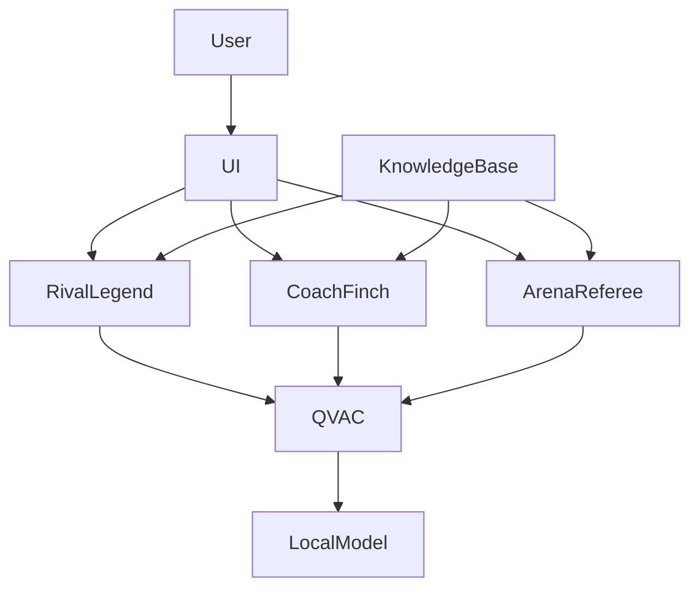

<div align="center">


# ⚽ GOAT Arena

### Defend Your Legend. Challenge the Rival. Conquer the Arena.

**A Local-First Multi-Agent Football Debate Arena Powered by QVAC**

<br>

<a href="https://github.com/tetherto/qvac">
  
</a>

<br>


</div>

---

> *"Every football fan thinks they can win the argument. GOAT Arena finally gives them an opponent that fights back."*

---

# 🎥 Demo

<div align="center">

<a href="https://youtu.be/u84R9EKBsTc">
  
</a>

**Click the image above to watch the full demo**

</div>

---

# 📖 Table of Contents

- [Overview](#-overview)
- [Why GOAT Arena?](#-why-goat-arena)
- [Why QVAC?](#-why-qvac)
- [Agent Architecture](#-agent-architecture)
  - [Rival Legend](#️-rival-legend)
  - [Coach Finch](#-coach-finch)
  - [Arena Referee](#️-arena-referee)
- [Gameplay Flow](#-gameplay-flow)
- [Scoring System](#-scoring-system)
- [System Architecture](#️-system-architecture)
- [Setup Guide](#-setup-guide)
- [Future Roadmap](#-future-roadmap)
- [License](#-license)

---

# 🚀 Overview

GOAT Arena is a **local-first AI football debate game** built for the **QVAC × Tether Hackathon**.

Instead of endless arguments on social media, fans enter a competitive arena where they must defend their football legends and national teams against intelligent AI opponents running entirely on-device.

### Popular Rivalries

- Messi vs Ronaldo
- Mbappé vs Haaland
- Argentina vs Brazil

### Powered by Three Specialized Agents

- ⚔️ **Rival Legend** — The opponent
- 🦉 **Coach Finch** — Strategic advisor
- 🏛️ **Arena Referee** — Independent judge

Every rebuttal, coaching suggestion, and verdict is generated locally through QVAC.

### No Cloud Required

✅ Local AI Inference  
✅ No External APIs  
✅ No Subscription Costs  
✅ Privacy First  
✅ Offline Capable

---

# ⚽ Why GOAT Arena?

Football debates happen everywhere:

- X / Twitter
- Reddit
- WhatsApp
- Discord
- Watch Parties
- Stadiums

The same questions keep returning:

- Who is the GOAT?
- Which nation has the greatest football legacy?
- Which player deserves the spotlight?

Most debates eventually become repetitive opinion exchanges.

GOAT Arena transforms those discussions into a structured competitive experience where users must defend their positions against a relentless AI challenger.

Instead of arguing with strangers online, fans face an AI opponent that never backs down.

---

# 🧠 Why QVAC?

GOAT Arena was intentionally designed around **QVAC's local-first AI architecture**.

Traditional AI applications often depend on cloud infrastructure.

| Traditional AI | GOAT Arena |
|---------------|-------------|
| Cloud APIs | Local Inference |
| Internet Required | Offline Capable |
| Usage Costs | Free to Run |
| External Infrastructure | Fully Self-Contained |
| Data Leaves Device | Privacy Preserved |

---

## 🔒 Privacy First

All conversations remain on the user's device.

No football debates are sent to external servers.

---

## 📴 Offline Gameplay

The arena works even without internet connectivity.

---

## ⚡ Low Latency

No network requests.

No API queues.

Responses are generated directly on-device.

---

## 💰 Zero Usage Cost

Once installed, users own the experience.

No subscriptions required.

---

## 🛠️ Developer Control

The entire intelligence stack remains local and customizable.

---

# 🤖 Agent Architecture

GOAT Arena uses three specialized AI agents with distinct personalities and responsibilities.

This separation creates a more engaging and balanced experience than a single general-purpose chatbot.

---

# ⚔️ Rival Legend

<div align="center">


</div>

### Role

The primary opponent.

### Personality

Most AI assistants are designed to be helpful and agreeable.

That makes for terrible debates.

Rival Legend was intentionally designed to be:

- Competitive
- Aggressive
- Confident
- Entertaining
- Relentless
- Occasionally sarcastic

### Responsibilities

- Defend its assigned side
- Challenge weak arguments
- Introduce counterpoints
- Apply constant pressure
- Maintain debate intensity

### Goal

Simulate debating a passionate football fan who refuses to concede.

---

# 🦉 Coach Finch

<div align="center">


</div>

### Role

Strategic assistant.

### Design Philosophy

Coach Finch is intentionally less powerful than the Rival Legend.

If it generated perfect answers, players would no longer need to think critically.

Instead, Coach Finch acts as an assistant coach rather than a debate autopilot.

### Responsibilities

- Suggest supporting facts
- Provide historical context
- Highlight opponent weaknesses
- Recommend counterarguments

### Restrictions

Coach Finch:

- Does not debate directly
- Does not generate complete winning responses
- Does not replace player decision-making
- Only responds to strategic questions

### Goal

Help players improve while preserving challenge and competitiveness.

---

# 🏛️ Arena Referee

<div align="center">


</div>

### Role

Independent judge.

### Responsibilities

- Evaluate both sides
- Score each round
- Explain decisions
- Produce final verdicts

### Goal

Deliver fair, transparent, and explainable outcomes.

The referee never participates in the debate itself.

---

# 🎮 Gameplay Flow

Every debate follows a structured competitive format.

| Stage | Description |
|---------|-------------|
| Rivalry Selection | Choose a football rivalry |
| Side Selection | Pick a player or national team |
| Round 1 | Opening arguments |
| Round 2 | Rebuttal phase |
| Round 3 | Advanced counterarguments |
| Strategic Timeout | Consult Coach Finch |
| Final Round | Closing statements |
| Verdict | Arena Referee decides the winner |

This transforms a simple chat into a competitive football debate game.

---

## 🎯 Gameplay Principles

| Feature | Purpose |
|----------|----------|
| Rival Agent | Creates challenge and replayability |
| Strategic Timeout | Provides assistance without removing difficulty |
| Multi-Round Structure | Encourages deeper arguments |
| Transparent Scoring | Creates clear win conditions |
| Football Knowledge Base | Grounds responses in football facts |
| Local AI | Fast, private, and offline-ready |

---

# 🏆 Scoring System

The Arena Referee evaluates every round using four categories.

| Category | Description |
|-----------|-------------|
| Evidence | Statistics, achievements, and supporting facts |
| Logic | Quality and consistency of reasoning |
| Relevance | Alignment with the debate topic |
| Persuasion | Ability to convince and challenge |

---

## Round Scoring

Each category receives a score from:

```text
0 – 10
```

Maximum score per round:

```text
Evidence   (10)
Logic      (10)
Relevance  (10)
Persuasion (10)

Total = 40 Points
```

### Example

| Category | Score |
|-----------|--------|
| Evidence | 8 |
| Logic | 7 |
| Relevance | 9 |
| Persuasion | 8 |
| Total | 32 / 40 |

---

## Match Scoring

Scores accumulate across all rounds.

```text
Final Score
=
Round 1
+ Round 2
+ Round 3
+ Final Round
```

The participant with the highest score wins the arena.

---

# 🏗️ System Architecture



---

## Knowledge Layer

```text
knowledge/
├── messi.md
├── ronaldo.md
├── mbappe.md
├── haaland.md
├── argentina.md
└── brazil.md
```

Section-based retrieval keeps prompts compact and efficient for local inference.

---

## Why This Architecture Works

| Agent | Purpose |
|---------|---------|
| ⚔️ Rival Legend | Creates challenge |
| 🦉 Coach Finch | Provides assistance |
| 🏛️ Arena Referee | Ensures fairness |

Together they transform football debates into a structured competitive experience powered entirely by local AI.

---

# 🚀 Setup Guide

## Prerequisites

- Node.js 22.x
- npm 10.x

---

## 1. Install QVAC CLI

```bash
npm install -g @qvac/cli
```

Verify installation:

```bash
qvac --version
```

Validate your environment:

```bash
qvac doctor
```

Expected output:

```text
✅ All required checks passed.
```

---

## 2. Clone the Repository

```bash
git clone <repository-url>
cd goat-arena
```

---

## 3. Install Dependencies

```bash
npm install
```

---

## 4. Run the Application

```bash
npm run dev
```

Open:

```text
http://localhost:3000
```

---

## Tested Environment

- Node.js 22.17.0
- npm 10.x
- QVAC CLI 0.8.0
- QVAC SDK 0.14.1
- macOS Sequoia

---

## Verification Checklist

After startup:

- ✅ Model loads successfully
- ✅ Rival Legend responds correctly
- ✅ Coach Finch provides coaching
- ✅ Arena Referee generates scores and verdicts

---

# 🗺️ Future Roadmap

The current release represents the MVP.

Planned enhancements include:

- Football-specific model fine-tuning
- Voice-enabled debates
- Multiplayer fan battles
- Tournament mode
- Live crowd reactions
- Additional rivalries
- Larger local models
- Enhanced retrieval pipelines

---

# 📄 License

Apache License 2.0

Built for the **QVAC × Tether Hackathon 2026**.

---

<div align="center">

### ⚽ Defend Your Legend. Challenge the Rival. Conquer the Arena.

**Powered entirely by QVAC.**

</div>
